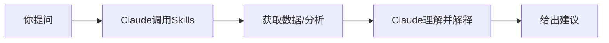

# ClaudeQuant - 快速开始指南

## 项目已重构完成！

这是一个基于 Claude Code 的 AI 持仓分析助手，通过对话式交互为你提供股票分析。

## 当前状态

✅ 项目结构已完成
✅ 核心功能已实现
✅ Claude Code Skills 已创建
✅ 文档已完善

## 下一步操作

### 1. 安装依赖

```bash
pip install -r requirements.txt
```

### 2. 配置持仓

编辑 `.env` 文件：

```bash
# 已有 .env 文件，请填入你的 Tushare Token
# 并配置持仓股票代码
TUSHARE_TOKEN=你的token
PORTFOLIO_SYMBOLS=000001,600519,000858
```

### 3. 测试 Skills

```bash
# 测试持仓概况
./skills/portfolio.sh

# 测试行情获取
./skills/quote.sh 000001

# 测试技术分析
./skills/technical.sh 000001

# 生成完整分析报告
./skills/analyze.sh
```

## 在 Claude Code 中使用

在 Claude Code 对话中，你可以这样问：

### 示例 1: 查看持仓
```
你：当前持仓的状况是怎样的？
```

Claude 会调用 `/portfolio` skill 获取实时行情并分析。

### 示例 2: 深度分析
```
你：帮我分析一下平安银行(000001)的技术面
```

Claude 会调用 `/quote` 和 `/technical` skills 进行详细分析。

### 示例 3: 生成报告
```
你：给我生成一份完整的持仓分析报告
```

Claude 会调用 `/analyze` skill 生成 Markdown 报告。

## 项目特点

### 与原来的区别

**原版本**（量化回测平台）:
- 需要手动运行回测命令
- 固定的策略框架
- 复杂的配置

**新版本**（AI 持仓助手）:
- 通过对话式交互
- Claude 提供智能分析
- 简单的持仓配置
- 实时行情 + 技术分析
- Markdown 报告

### 核心功能

1. **实时行情**: 获取股票最新价格和涨跌幅
2. **技术分析**: 自动计算 MA、MACD、RSI、布林带
3. **智能建议**: 基于技术指标给出买入/卖出/持有建议
4. **AI 分析**: Claude 理解技术指标，用自然语言解释
5. **Markdown 报告**: 生成详细的分析报告

## 使用流程



## 文件说明

- `cli.py`: 命令行工具（被 skills 调用）
- `skills/*.sh`: Claude Code Skills脚本
- `src/quote/`: 行情获取模块
- `src/analysis/`: 技术分析模块
- `src/report/`: 报告生成模块
- `reports/`: 生成的分析报告

## 常见问题

### Q: Tushare Token 在哪获取？
A: 访问 https://tushare.pro/ 注册并获取免费 Token

### Q: 如何添加更多持仓？
A: 编辑 `.env` 文件中的 `PORTFOLIO_SYMBOLS`，用逗号分隔

### Q: 技术指标可以自定义吗？
A: 可以，编辑 `config/default.yaml` 中的指标配置

### Q: 报告保存在哪里？
A: `reports/` 目录，最新报告为 `reports/latest.md`

## 下一步改进

- [ ] 增加更多技术指标（KDJ、BOLL 等）
- [ ] 支持港股、美股
- [ ] 添加市场情绪分析（新闻、公告）
- [ ] 支持回测功能（可选）
- [ ] 移动端推送通知

---

**现在就试试吧！**

在 Claude Code 中问：
> "我的持仓现在怎么样？"

让 AI 成为你的投资助手！🚀
